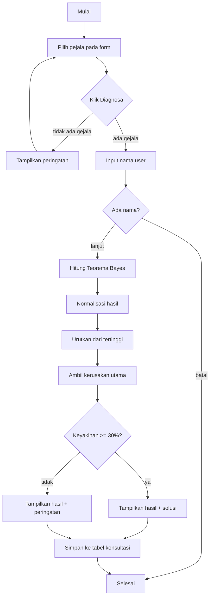
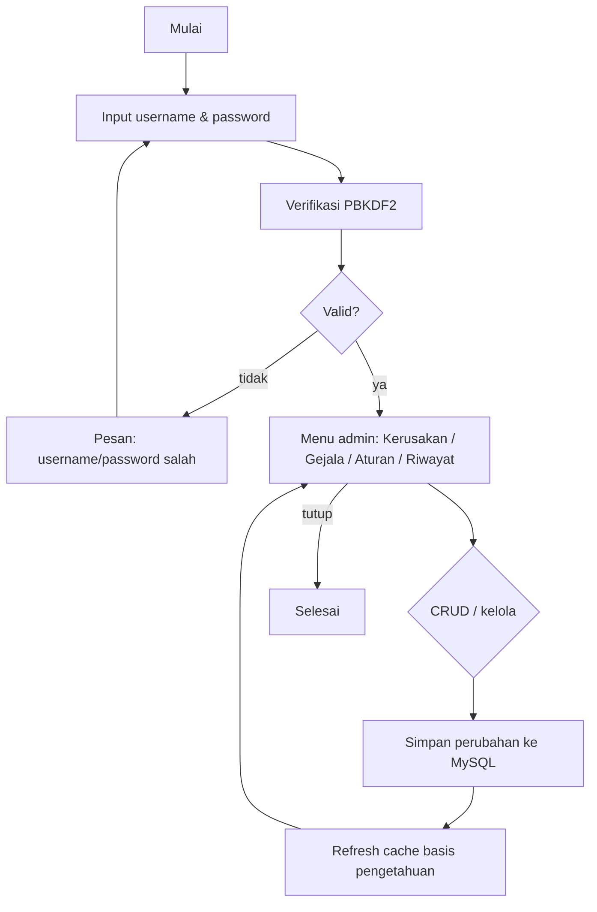
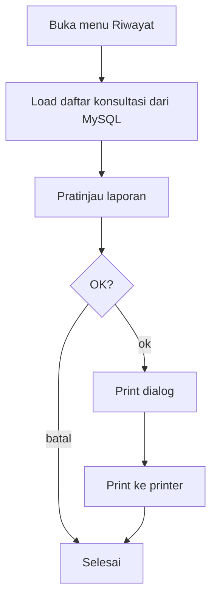

# Activity Diagram — Konsultasi Diagnosa

```mermaid
flowchart TD
    A[Mulai] --> B[Pilih gejala pada form]
    B --> C{Klik Diagnosa}
    C -->|tidak ada gejala| D[Tampilkan peringatan]
    D --> B
    C -->|ada gejala| E[Input nama user]
    E --> F{Ada nama?}
    F -->|batal| Z[Selesai]
    F -->|lanjut| G[Hitung Teorema Bayes]
    G --> H[Normalisasi hasil]
    H --> I[Urutkan dari tertinggi]
    I --> J[Ambil kerusakan utama]
    J --> K{Keyakinan >= 30%?}
    K -->|ya| L[Tampilkan hasil + solusi]
    K -->|tidak| M[Tampilkan hasil + peringatan]
    L --> N[Simpan ke tabel konsultasi]
    M --> N
    N --> Z
```

## Activity Diagram — Login Admin

```mermaid
flowchart TD
    A[Mulai] --> B[Input username & password]
    B --> C[Verifikasi PBKDF2]
    C --> D{Valid?}
    D -->|tidak| E[Pesan: username/password salah]
    E --> B
    D -->|ya| F[Menu admin: Kerusakan / Gejala / Aturan / Riwayat]
    F --> G{CRUD / kelola}
    G --> H[Simpan perubahan ke MySQL]
    H --> I[Refresh cache basis pengetahuan]
    I --> F
    F -->|tutup| Z[Selesai]
```

## Activity Diagram — Cetak Laporan

```mermaid
flowchart TD
    A[Buka menu Riwayat] --> B[Load daftar konsultasi dari MySQL]
    B --> C[Pratinjau laporan]
    C --> D{OK?}
    D -->|batal| Z[Selesai]
    D -->|ok| E[Print dialog]
    E --> F[Print ke printer]
    F --> Z
```